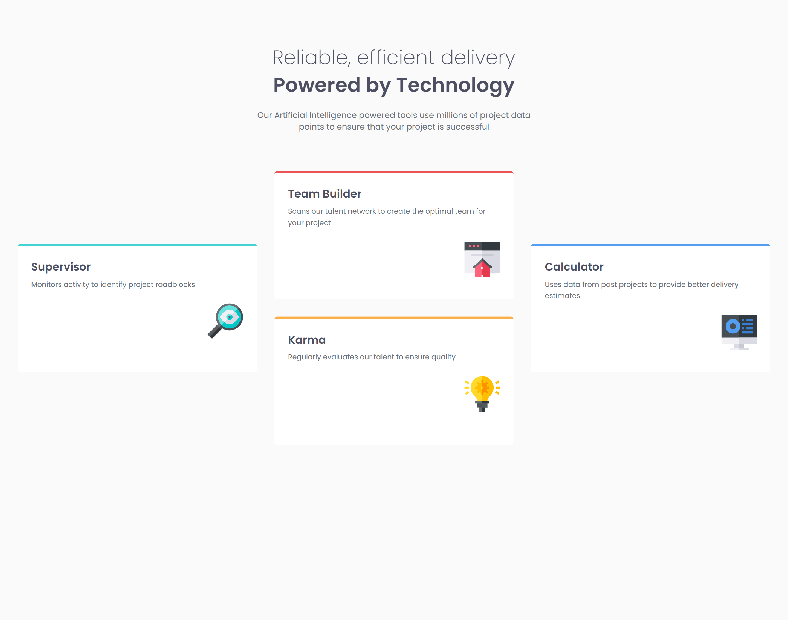

# Frontend Mentor - Four card feature section solution

This is a solution to the [Four card feature section challenge on Frontend Mentor](https://www.frontendmentor.io/challenges/four-card-feature-section-weK1eFYK). Frontend Mentor challenges help you improve your coding skills by building realistic projects. 

## Table of contents

- [Overview](#overview)
  - [Screenshot](#screenshot)
  - [Links](#links)
- [My process](#my-process)
  - [Built with](#built-with)
  - [What I learned](#what-i-learned)

## Overview

### Screenshots

### Links

- Live Site URL: [Solution online](https://dovlicio.github.io/social-links-profile-component/)

## My process

### Built with

- Semantic HTML5 markup
- CSS custom properties
- Flexbox
- Grid
- Mobile-first workflow
- Responsive design

### What I learned
Great exercise for practicing and improving HTML and CSS skills, building responsive layouts.
